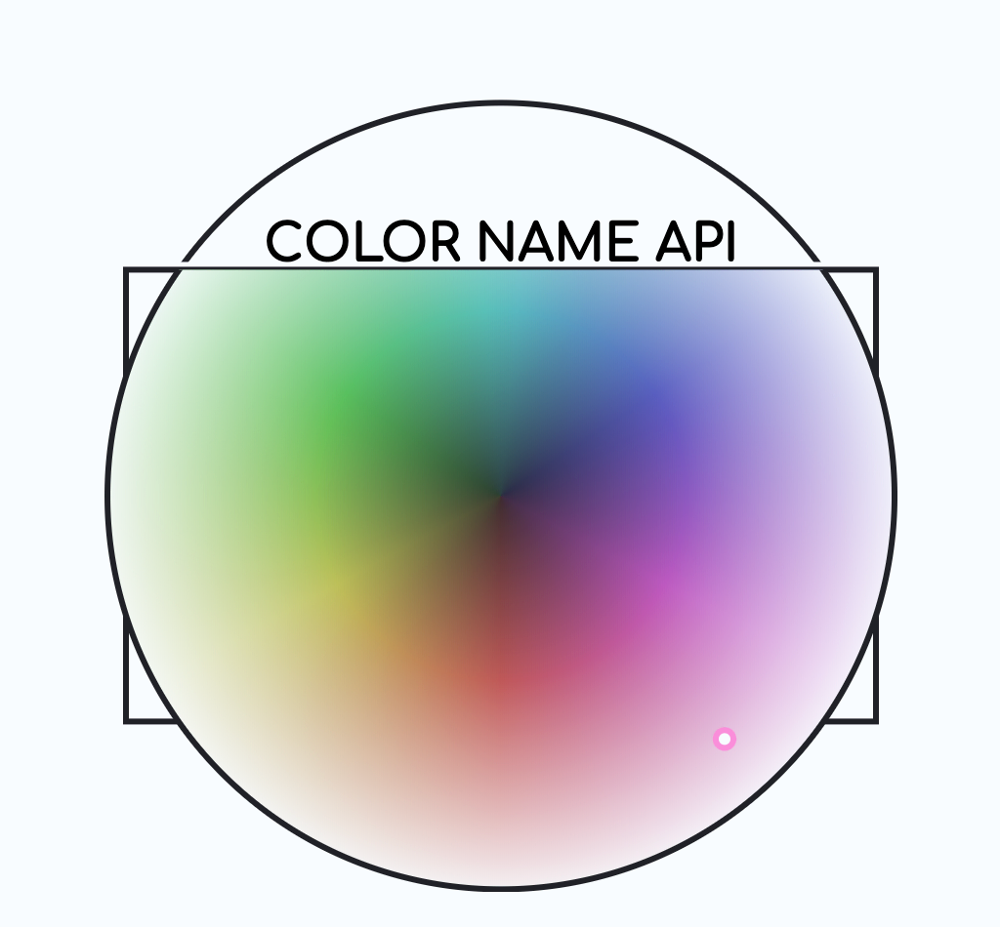

# Color Name API

[](https://github.com/sponsors/meodai)
[](https://www.npmjs.com/package/color-name-api)

Rest API that returns a bunch of color names for a given color-value.

Introducing a comprehensive and easy to use color-naming API!
Easily retrieve the color name for any hexadecimal color value, using a variety of different color name lists. Whether you're working on a design project or building a color-themed application, our API has you covered.

## Why Use Color Names?

While hex codes are precise, they're not intuitive for humans. Color names bridge the gap between technical accuracy and human understanding. Instead of saying "#fa8072", you can say "Salmon" – which immediately conveys meaning and context.

## Use Cases

This API solves real-world problems across various domains:

### 🎨 **Design & Creative Tools**

- **Design Software**: Show human-readable color names in color pickers and palettes
- **Generative Art**: [Poline gradient generator](https://meodai.github.io/poline/) uses named colors for more intuitive palette creation
- **Color Palette Tools**: [Farbvelo](https://farbvelo.elastiq.ch/) demonstrates real-time color naming for palette exploration

### ♿ **Accessibility & Screen Readers**

- **Screen Reader Support**: Provide meaningful color descriptions instead of just RGB values
- **Color Blind Users**: Offer descriptive names alongside visual color representations
- **Voice Interfaces**: Enable color selection through spoken color names

### 🛠️ **Development & Debugging**

- **CSS Development**: Generate human-readable color variable names automatically
- **Debug Logs**: Make color values in logs more readable ("Midnight Blue" vs "#191970")
- **API Documentation**: Auto-generate color examples with intuitive names

### 📊 **Data Visualization**

- **Chart Libraries**: Automatically name data series colors for legends
- **Dashboard Tools**: Provide accessible color descriptions for data points
- **Reporting**: Generate color-coded reports with named color categories

### 🏢 **Business Applications**

- **E-commerce**: Name product colors automatically from uploaded images
- **Brand Guidelines**: Maintain consistent color naming across teams

### 🎮 **Gaming & Interactive Media**

- **Customization Systems**: Let users describe and share custom color schemes
- **World Generation**: Procedurally name environmental colors
- **UI Themes**: Provide descriptive names for theme variations

### 📱 **Mobile & Web Apps**

- **Color Picker Widgets**: Enhance user experience with named color feedback
- **Theme Builders**: Help users understand and communicate color choices
- **Content Management**: Auto-tag content based on dominant colors

## Reverse Lookup: Search by Color Name

The API also works in reverse – you can search by color name to get hex values, making it perfect for natural language color interfaces. This enables users to say "I want salmon pink" instead of having to know "#fa8072".

```shell
# Search for colors by name
$ curl 'https://api.color.pizza/v1/names/?name=red'

➜ {
➜   "colors": [
➜     {
➜       "name": "Red",
➜       "hex": "#ff0000",
➜       "rgb": {"r": 255, "g": 0, "b": 0},
➜       "hsl": {"h": 0, "s": 100, "l": 50},
➜       "similarity": 1.0
➜     },
➜     {
➜       "name": "Dark Red",
➜       "hex": "#8b0000",
➜       "rgb": {"r": 139, "g": 0, "b": 0},
➜       "hsl": {"h": 0, "s": 100, "l": 27.25},
➜       "similarity": 0.75
➜     }
➜   ]
➜ }
```

### Similarity Scoring

Each search result includes a `similarity` score (0-1) that indicates how closely the color name matches your search term:

- **1.0**: Exact match (e.g., searching "red" finds "Red")
- **0.8-0.9**: Very close match (substring or minor variations)
- **0.6-0.8**: Good match (fuzzy matching, handles typos)
- **Below 0.6**: Filtered out (too dissimilar)

The similarity is calculated using **Levenshtein distance**, which measures the minimum number of single-character edits needed to transform one string into another. This enables intelligent fuzzy matching that can handle:

- **Typos**: "grren" finds "Green"
- **Partial matches**: "sal" finds "Salmon"
- **Case variations**: "RED" finds "Red"
- **Common misspellings**: "bleu" finds "Blue"

### Search Parameters

```shell
# Limit results (default: 20, max: 50)
$ curl 'https://api.color.pizza/v1/names/?name=red&maxResults=5'

# Use different color lists
$ curl 'https://api.color.pizza/v1/names/?name=red&list=wikipedia'
```

This reverse functionality is particularly useful for:

- Voice-controlled design applications
- Conversational interfaces for color selection
- Natural language processing in creative tools
- Accessibility features where users describe colors verbally
- Building search-as-you-type color pickers

## Documentation

- [Configuration Guide](docs/CONFIGURATION.md) - Complete environment variables reference
- [Deployment Guide](docs/DEPLOYMENT.md) - Production deployment instructions (Fly.io, Docker, VPS)
- [Development Guide](docs/DEVELOPMENT.md) - Local development setup and testing

## Technical Details

- **Runtime**: Supports both Node.js (via tsx) and Bun – choose your preferred runtime
- **Distance Metric**: Uses CIEDE2000 ΔE for perceptually accurate color matching
- **Similarity Scoring**: Name search uses Levenshtein distance for fuzzy matching with typo tolerance
- **Multiple Lists**: Choose from various color naming systems (Wikipedia, RAL, Pantone, etc.)
- **Unique Names**: Optional `noduplicates` parameter ensures each color gets a distinct name
- **Real-time Updates**: WebSocket support for live color naming applications

### Quick Local Setup

```bash
# With npm (Node.js)
npm install && npm run dev

# With Bun
bun install && bun run dev:bun
```

See [Development Guide](docs/DEVELOPMENT.md) for full setup instructions.

## Getting started with the REST API

### Hello World

Let's start by testing the API. Open up a command prompt and enter the following command:

```shell
$ curl https://api.color.pizza/v1/?values=aaffcc

➜ {
➜   "colors":
➜    [
➜      {
➜        "name":"Neo Mint",
➜        "hex":"#aaffcc",
➜        "rgb":{"r":170,"g":255,"b":204},
➜        "hsl":{"h":144,"s":100,"l":83.33333},
➜        "lab":{"l":93.57729,"a":-34.63514,"b":15.94209},
➜        "luminance":159.78151,
➜        "luminanceWCAG":0.84426,
➜        "requestedHex":"#aaffcc",
➜        "distance":0
➜       }
➜    ],
➜    "paletteTitle":"Neo Mint"
➜  }
```

The response will be a JSON Object containing two keys: `colors` and `paletteTitle`
_colors_ will contain an array of all the colors you have asked for, with some useful information like `name` or `hsl`.

Now, let's `GET` the names for multiple colors:

```shell
$ curl 'https://api.color.pizza/v1/?values=0d0d0f,f39d91,d4d4d7'

➜
{
  "paletteTitle":"Ruined Amber",
  "colors":[
    {
      "name":"Ruined Smores",
      "hex":"#0f1012",
      "rgb":{
        "r":15,
        "g":16,
        "b":18
      },
      "hsl":{
        "h":220,
        "s":9.09091,
        "l":6.47059
      },
      "lab":{
        "l":4.64662,
        "a":-0.0655,
        "b":-1.21669
      },
      "luminance":10.60828,
      "luminanceWCAG":0.00516,
      "requestedHex":"#0d0d0f",
      "distance":0.7732
    },
    {
      "name":"Peach Amber",
      "hex":"#fb9f93",
      "rgb":{
        "r":251,
        "g":159,
        "b":147
      },
      "hsl":{
        "h":7,
        "s":92.85714,
        "l":78.03922
      },
      "lab":{
        "l":74.88027,
        "a":34.17564,
        "b":21.39099
      },
      "luminance":120.93069,
      "luminanceWCAG":0.47412,
      "requestedHex":"#f39d91",
      "distance":1.39432
    },
    {
      "name":"Nimbus Cloud",
      "hex":"#d5d5d8",
      "rgb":{
        "r":213,
        "g":213,
        "b":216
      },
      "hsl":{
        "h":240,
        "s":3.7037,
        "l":84.11765
      },
      "lab":{
        "l":85.33592,
        "a":0.40788,
        "b":-1.48475
      },
      "luminance":142.46096,
      "luminanceWCAG":0.66693,
      "requestedHex":"#d4d4d7",
      "distance":0.23432
    }
  ]
}
```

The response now contains 3 objects in the `colors` array. The API will return the closest color names if can find for each requested color.
The come from a [large collection](https://github.com/meodai/color-names). If for some reason you don't like the names, there are several other lists to choose from. So lets get the same names from a differet `list`.

```shell
$ curl 'https://api.color.pizza/v1/?values=0d0d0f,f39d91,d4d4d7&list=wikipedia'
```

### Access API Documentation

The API serves static HTML documentation at the `/docs/` endpoint:

```shell
$ curl https://api.color.pizza/v1/docs/
```

### Get supported color name lists

```shell
$ curl 'https://api.color.pizza/v1/lists/'

➜
{
  availableColorNameLists: [
    "defaults",
    "colors",
    "bestOf",
    "basic"
    // ... //
  ],
  listDescriptions: {
    "basic": {
      "title": "Basic",
      "description": "A set of basic colors. Red, Green, Blue...",
      "source": "https://github.com/colorjs/color-namer/tree/master/lib/colors",
      "key": "basic"
      "colorCount": 21,
      "url": "/v1/?list=basic"
    },
    // ... //
  }
}
```

The response contains two keys: `availableColorNameLists` and `listDescriptions`.

`availableColorNameLists` is an array of all the color name lists currently supported by Color Names, such as Wikipedia, HTML color lists, traditional Japanese colors etc.

`listdescriptions`is an object whose keys are the name of the color lists with values containing useful information such as `title`, `description`, `source` etc.

In this [demo](https://codepen.io/bytrangle/full/jOpOrdv), you can preview names of common colors given by each list. You can also change the input colors and the corresponding names in each list will be updated on the spot.

Now when some of the requested colors are very similar you might get some duplicate names:

```shell
$ curl 'https://api.color.pizza/v1/?values=1b2b11,1c2f11,2e3f24&list=wikipedia'
```

Notice how `Phthalo Green` was returned twice.
What makes this API unique is that you can ask to return a color name only once. So if you ask for similar colors the api will make sure to return a unique color name per requested color.

```shell
$ curl 'https://api.color.pizza/v1/?values=1b2b11,1c2f11,2e3f24&list=wikipedia&noduplicates=true'
```

### Understanding the `noduplicates` Parameter

The `noduplicates=true` parameter is a powerful feature that ensures each requested color receives a unique name, even when colors are similar. When enabled:

- The API will never return the same color name twice in a single response
- Each color in your request will receive the closest available unique name
- Names are assigned in the order colors appear in your request
- The algorithm intelligently selects alternative names with minimal perceptual distance

This is particularly useful for:

- Generating diverse color palettes with distinct names
- Creating color legends where each item needs a unique identifier
- Building accessible interfaces where similar colors need distinguishable names
- Naming elements in data visualizations

#### Technical Implementation

The API uses an efficient Vantage Point Tree (VPTree) spatial data structure to find the nearest unique color names. When `noduplicates=true`, each assigned name is temporarily removed from future consideration within that request.

#### Best Practices

For optimal results with `noduplicates=true`:

- Use with larger color name lists: `default`, `bestOf`, `wikipedia`, `ntc`, `ral`, `ridgway` or `xkcd`
- Order your most important colors first in the request, as they'll receive the closest name matches
- Be aware that with very small color lists or many similar colors, later colors might receive less ideal name matches

In smaller color name lists, this can lead to unexpected results as the algorithm must choose increasingly distant color names. We suggest using this feature with some of the larger lists mentioned above.

#### Important Note About Color Limits

When using `noduplicates=true`, if you request more colors than are available in the selected list, the API will:

- Return as many uniquely named colors as possible (up to the size of the selected list)
- Drop any additional colors that can't be assigned unique names
- Return a response with fewer color objects than requested

For example, if you use the "basic" list (which has only 21 colors) and request 30 colors with `noduplicates=true`, the response will contain only 21 color objects.

This behavior ensures the API maintains its promise of providing truly unique names for each color, even in edge cases. If you need to name a large number of colors uniquely, make sure to use one of the larger color lists mentioned above.

## Request Limits

To ensure reliable performance and prevent abuse, the API enforces a maximum number of colors that can be requested at once:

- **Maximum colors per request:** 100 (default, configurable by the server admin)
- If you request more than this limit, the API will return an HTTP 400 error:

```json
{
  "error": {
    "status": 400,
    "message": "You can request up to 100 colors at once. You requested N."
  }
}
```

If you need to process more colors, please split your requests accordingly.

---

### Using WebSockets

The Color Name API also supports real-time color updates via WebSocket connections. It
broadcasts whenever new color names are requested through the API. If you're interested in using WebSockets with the API, please [create an issue](/issues) with your use case and domain.

Codepen is allowed by default. See the [demo](https://codepen.io/meodai/full/rNryZyE) for an example of how to use the WebSocket connection.

To use WebSockets with the API:

1. First, make sure your domain is on the allowed origins list. Currently, WebSocket connections are restricted to approved origins for security purposes. If you need access, please [create an issue](https://github.com/meodai/color-name-api/issues) with your use case and domain.

2. Connect to the WebSocket endpoint using a WebSocket client:

   ```javascript
   const socket = io("https://api.color.pizza", {
     transports: ["websocket"],
   });

   // Listen for color updates
   socket.on("colors", data => {
     console.log("Received color data:", data);
     // {
     //   paletteTitle: "Neo Mint",
     //   colors: [{
     //     name: "Neo Mint",
     //     hex: "#aaffcc",
     //     // ... other color properties
     //   }],
     //   list: "default"
     // }
   });
   ```

3. The WebSocket connection will automatically receive updates whenever new colors are requested through the API. The data format matches the REST API response structure, containing the `paletteTitle`, `colors` array, and the `list` used.

#### Server Configuration

If you're self-hosting the API, you can enable WebSocket support by setting the following environment variables:

```shell
SOCKET=true
ALLOWED_SOCKET_ORIGINS=https://yourdomain.com,https://otherdomain.com
```

Note that WebSocket support is optional and disabled by default. The REST API endpoints will continue to work regardless of WebSocket configuration.

### Custom Referrer Tracking with X-Referrer Header

The API supports custom referrer tracking via the `X-Referrer` header. This is useful when:

- The standard `Referer` header is stripped by privacy settings
- You want to explicitly identify your application or service
- You're making server-to-server requests where standard referrer information isn't available

To use this feature, simply include the `X-Referrer` header in your requests:

```shell
$ curl -H "X-Referrer: my-awesome-app" 'https://api.color.pizza/v1/?values=aaffcc'
```

or

```javascript
fetch("https://api.color.pizza/v1/?values=aaffcc", {
  headers: {
    "X-Referrer": "your-app-name",
  },
}).then(response => response.json());
```

When the API is configured with WebSockets enabled, this referrer information is included in the broadcasted socket events, allowing for tracking and analytics of color requests across different applications or domains.

This header is especially useful for:

- Attribution in multi-platform scenarios
- Tracking API usage from different client applications
- Understanding where color lookups are being performed

**Please include the X-Referrer header in your requests to help us understand how the API is being used. This information helps us improve the service and justify continued development and maintenance of this free API. Your support is greatly appreciated!**

## Distance Function & Color Matching Algorithm

The Color Name API uses the **CIEDE2000 ΔE** (Delta E) distance metric for perceptually accurate color matching. This advanced algorithm ensures that the color names returned are as close as possible to human visual perception.

### How It Works

1. **Input colors** are converted to the LAB color space (a perceptually uniform color space)
2. **Distance calculation** uses the CIEDE2000 formula to compute the ΔE between the input color and each color in our database
3. **Closest matches** are returned based on the smallest ΔE values
4. **Distance values** in the API response represent the calculated ΔE difference

## Well-known endpoints

This API exposes a few standardized discovery endpoints:

- `/.well-known/openapi.json` — Machine-discoverable OpenAPI JSON (same content as `/openapi.json`).
- `/.well-known/security.txt` — Security disclosure file (RFC 9116) with contact details and expiry.
- `/.well-known/ai-plugin.json` — Assistant/ChatGPT plugin manifest that references `/openapi.yaml` on the current host.

Environment variables:

- `SECURITY_CONTACT` — Email address used in `security.txt`.
- `CONTACT_EMAIL` — Contact email in `ai-plugin.json`.

All responses support gzip when the client sends `Accept-Encoding: gzip`.

### Understanding Distance Values

The `distance` field in API responses represents the CIEDE2000 ΔE value:

- **0.0**: Perfect match (identical colors)
- **< 1.0**: Differences not perceptible to most people
- **1.0 - 2.0**: Perceptible under ideal viewing conditions
- **2.0 - 10.0**: Perceptible at a glance
- **> 10.0**: Colors appear quite different

### Implementation

The API leverages the excellent [Culori](https://culorijs.org/api/) library for color space conversions and CIEDE2000 calculations, combined with a custom Vantage Point Tree (VP-tree) data structure for efficient nearest-neighbor searches across our extensive color database.

This ensures both accuracy and performance when matching colors to their closest named equivalents.

## Contributors

- **David Aerne** ([@meodai](https://github.com/meodai)) - Creator & maintainer
- **Shahin Farzane** ([@shahfarzane](https://github.com/shahfarzane)) - TypeScript rewrite, Hono framework migration, and backend architecture
